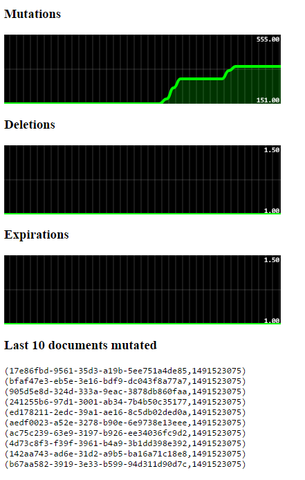

This project is using:

- Couchbase DCP client
- Akka Streams to stream Couchbase events properly 
- Akka-HTTP listening on `localhost:8080/ui`
- Akka-SSE because websockets are overrated
- Smoothie charts for the smooth charts

It's possible to listen to any server / any bucket thanks to a smart URL pattern:
`http://localhost:8080/ui/$host/$bucket`

Example: `http://localhost:8080/ui/couchbase01/travel`

You'll get this UI updated in real-time:

It is refreshed every 200ms by default, but this is configurable: `http://localhost:8080/ui/couchbase01/travel?interval=1000`
 
- It displays the total of events starting at the time you connect.
- It displays a chart per events containing the delta per interval.
- It displays the N last mutated documents of the bucket, with their expiry if any.

